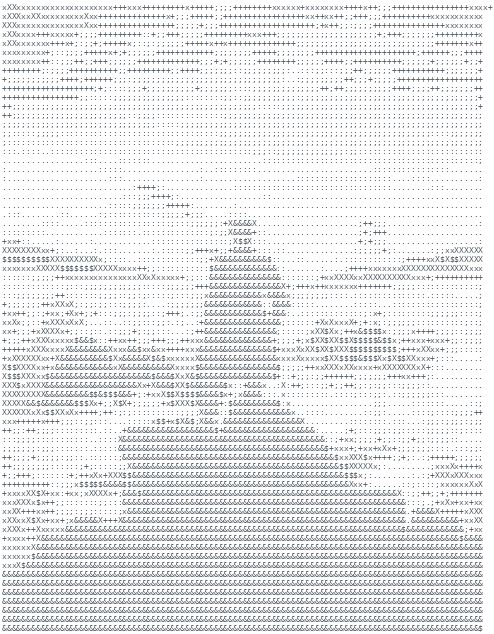

<table>
<tr>
<td width="300" valign="top">

</td>
<td valign="top">

### Dhaval Rasputala
**Backend Developer (Go) — open to internship / junior backend roles**

I build backend systems and like understanding what's actually happening under the abstractions — how a write becomes durable, how a request gets authorized. Currently building an Rate Limiting Gateway(private repo) , and exploring distributed systems fundamentals through [Distributed_Key_Value_Store](https://github.com/dhavalrasputala/Distributed_Key_Value_Store).

📫 dhavalrasputala@gmail.com · [LinkedIn](https://linkedin.com/in/dhavalrasputala)

</td>
</tr>
</table>

---

## Featured Projects

### [Distributed_Key_Value_Store](https://github.com/dhavalrasputala/Distributed_Key_Value_Store)
A key-value store written in Go from scratch — no external database, just a write-ahead log, an in-memory map, and leader → follower replication. Built to answer a specific question: what actually happens on disk in the moments after a database says a write is "durable."

- Every write is fsync'd to a WAL before it's considered committed; full state rebuild on startup by replaying the log
- Leader → follower replication over HTTP, with concurrent-safe reads/writes verified via `go test -race`
- Load-tested at 10,000 concurrent requests (0 failures)  see repo for the full breakdown
- README documents current limitations : no quorum acks, no leader election yet, no follower catch-up path

**Stack:** Go · HTTP · WAL/durability · concurrency

### [GateKeeper](https://github.com/dhavalrasputala/GateKeeper)
A lightweight, dependency-free RBAC (role-based access control) engine for Go — manages users, roles, and permissions, and answers one question fast: *can this user do this action on this resource?*

- Typed sentinel errors throughout (`errors.Is`-compatible) instead of generic error strings
- Defensive copies on reads so callers can't mutate internal engine state
- Fully tested; zero external dependencies

**Stack:** Go · access control · API design

---

## Tech Stack

---

## Connect

